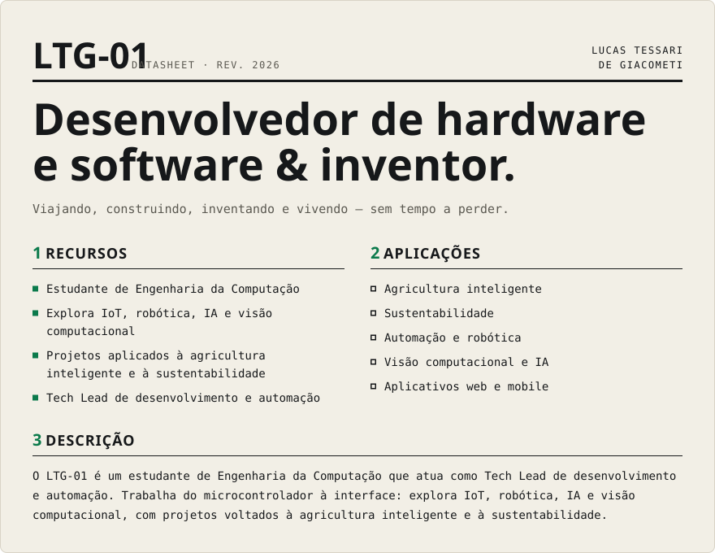
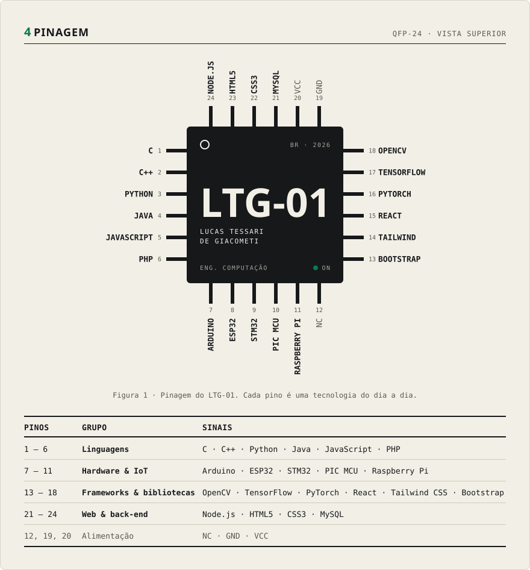
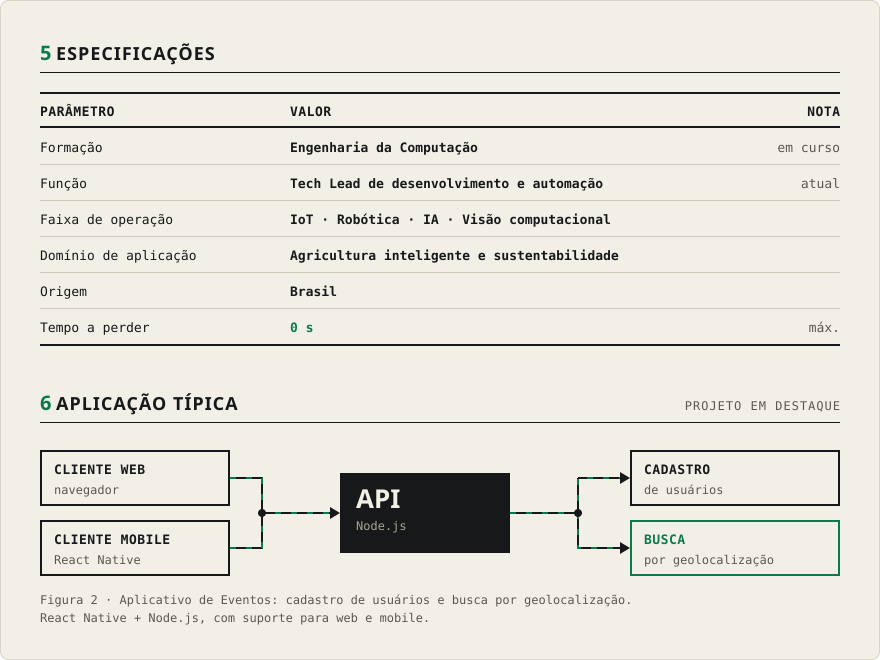
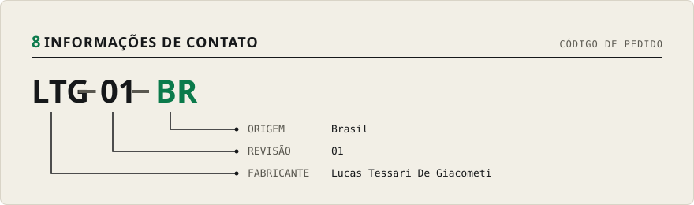

<!--
  Perfil no formato de datasheet de componente (LTG-01).
  As imagens em assets/ são geradas a partir de assets/src/ com:
    pip install fonttools brotli && python assets/src/build.py
-->

  

  

  

  

  
  

  

  

  

  

  

Versão em texto

### Sobre mim
- Estudante de **Engenharia da Computação**
- Explorando **IoT, Robótica, IA e Visão Computacional**
- Projetos aplicados à **agricultura inteligente e sustentabilidade**
- Atuando como **Tech Lead de Desenvolvimento e Automação**

### Tecnologias
- **Linguagens:** C, C++, Python, Java, JavaScript, PHP
- **Frameworks & bibliotecas:** OpenCV, TensorFlow, PyTorch, React, Tailwind CSS, Bootstrap
- **Web & back-end:** Node.js, HTML5, CSS3, MySQL
- **Hardware & IoT:** Arduino, ESP32, STM32, PIC MCU, Raspberry Pi

### Projeto em destaque: Aplicativo de Eventos
- Cadastro de usuários e busca por geolocalização
- Desenvolvido em React Native + Node.js
- Suporte para web e mobile

### Contato
- E-mail: [lucas.tessari616@gmail.com](mailto:lucas.tessari616@gmail.com)
- LinkedIn: [lucas-tessari-de-giacometi](https://linkedin.com/in/lucas-tessari-de-giacometi-a34b4b243)

